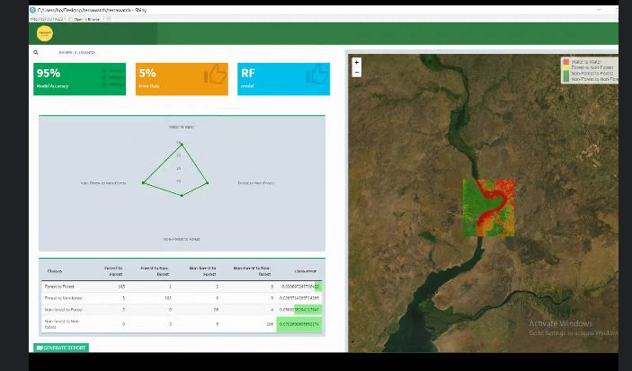

# terrawatch
Continuation of the project "Change detection for Land cover mapping in the areas surrounding the Murchison Falls National Park". Documents development of online tool with dashboard, maps, graphs and stats.
## Prototyping
### Screenshot 1
Here, the enduser is able to draw a polygon around the area where they'd like to conduct a landcover change analysis. It could be anywhere in the world.

Figure 1. Screenshot shows the selection capabilities of the Area of Interest of endsuser 

### Screenshot 2
Here, the enduser is able to draw a polygon around the area where they'd like to conduct a landcover change analysis. It could be anywhere in the world.

Figure 2. Screenshot shows the selection capabilities of the Area of Interest of endsuser 

### Screenshot 3
Here, the enduser is able to draw a polygon around the area where they'd like to conduct a landcover change analysis. It could be anywhere in the world.

Figure 3. Screenshot shows the selection capabilities of the Area of Interest of endsuser 

