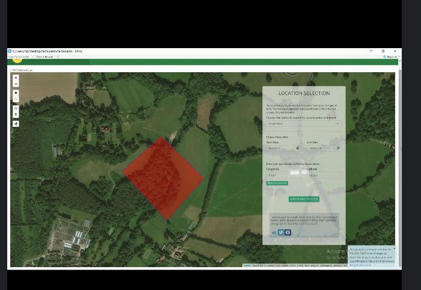
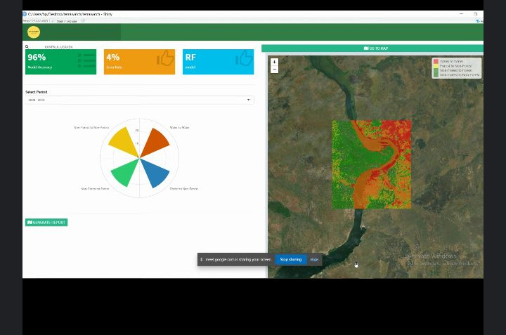

# Terrawatch
Continuation of the project "Change detection for Land cover mapping in the areas surrounding the Murchison Falls National Park". Documents development of online tool with dashboard, maps, graphs and stats.
## Prototyping
### Screenshot 1
Here, the enduser is able to draw a polygon around the area where they'd like to conduct a landcover change analysis.They can also input coordinates from their field work location or type a less granular location like name of a place. It could be anywhere in the world.

Figure 1. Screenshot shows the selection capabilities of the Area of Interest of endsuser 

### Screenshot 2
Here, the enduser is able to view statistics, accuracy/performance of the model, quatity of change for each land cover class for the defined Area of Interest.The enduser specifies the Area of Interest by drawing a polygon in the basemap where they'd like to conduct a landcover change analysis. It could be anywhere in the world.The information is visualised and plotted on graphs, text and maps.

Figure 2. Screenshot shows stats, graphs and maps of Area of Interest after running the model

### Screenshot 3
Here, the enduser is able to export summarized information and insights as produced by the model, training data and collected data from the field also same as the raw data embedded in the satellite image

Figure 3. Screenshot allows enduser to export land cover change insights embedded in graphs, text and maps for Area of Interest of endsuser for use in their projects, research, policy work, advocacy 

